# Trabalho prático 1 de Segurança em Redes de Computadores

## Autores
- Ana Vidal (118408)
- Simão Andrade (118345)

## Estrutura do Relatório

1. Introdução;
2. Objetivos;
3. Política de segurança (Simão);
4. Ponto 9:
   1. Rotas de Rede e conectividade;
   2. Load-Balancers;
   3. Sincronização de Estados de Dispositivos;
   4. Testes de Funcionamento (Ana e Simão);
   5. Questões Finais;
5. Ponto 10:
   1. Configuração do Servidor DMZ;
   2. Configuração da Firewall;
   3. Zonas e Regras;
   4. Testes de Funcionamento (Ana e Simão)
6. Conclusão;

## Introdução

> [!TIP]
> **Comentário**: O foco da introdução é apresentar o tema do trabalho, não é necessário falar sobre as ferramentas usadas (VyOS). Começar em que âmbito o trabalho foi feito, depois falar sobre a sincronização de estados, introduzir (NÃO DESENVOLVER MUITO) que existem prós-e-contras relativamente á sua implementação, depois falar sobre as firewalls (DE MODO BREVE) e explicar que para uma boa defesa de uma rede é necessário definir um conjunto de politicas de controlo de fluxo de tráfego, e que é isso que será feito no trabalho.

Nos dias de hoje, a continuidade operacional e a segurança das redes desempenham um papel crítico no ambiente empresarial. No âmbito da segurança cibernética, os firewalls assumem uma importância inegável na proteção dos ativos e na defesa contra ameaças digitais. Este trabalho tem como objetivo explorar os cenários de firewalls de alta disponibilidade utilizando a plataforma VyOS. O VyOS é uma solução de código aberto reconhecida pela sua flexibilidade e recursos avançados de segurança. Focar-nos-emos na configuração de firewalls redundantes e na distribuição de carga de tráfego, com o propósito de garantir a disponibilidade contínua dos serviços de rede. Adicionalmente, iremos analisar a implementação de funcionalidades como o conntrack-sync, que permite a sincronização de estados de conexão entre os dispositivos de firewall, potenciando ainda mais a resiliência da infraestrutura de segurança.

## Objetivos

Apresentar um relatório dos **testes de configuração** e de **funcionamento** dos cenários descritos nos pontos `9` e `10` do guia laboratorial “High-Availability Firewall Scenarios”.

Temos as seguintes tarefas a serem realizadas:

- [x] Firewall and load-balancers deployment (2 valores).
- [x] Network routing and connectivity (2 valores).
- [x] Devices state synchronization (3 valores).
- [x] Zones definition (3 valores).
- [x] Inter-zone rules (6 valores).
- [ ] Report (4 valores).

## Política de Segurança

A política de segurança deve priorizar a proteção dos recursos da rede, garantindo que apenas o tráfego necessário e seguro seja permitido e implementando medidas para mitigar possíveis ataques. 

Com base nisso, as foram definidas as seguintes diretrizes de segurança a serem implementadas:

| Código | Descrição                                                                                                                             |
| ------ | ------------------------------------------------------------------------------------------------------------------------------------- |
| D_01   | A rede interna irá receber apenas o tráfego estabelecido por esta, bloqueando todo o tráfego não solicitado.                          |
| D_02   | As comunicações para a rede exterior serão apenas permitidas para continuidade de serviços (e.g. acesso remoto a serviços, internet). |
| D_03   | A rede interna e a DMZ deverão ser capazes de manter a sua disponibilidade e conseguir gerir todos os pedidos recebidos.              |
| D_04   | O acesso ao servidor DMZ será permitido apenas durante o horário laboral.                                                             |
| D_05   | O exterior não deverá ser capaz de comunicar diretamente com a rede interna.                                                          |

## Ponto 9

### Topologia

<p align="center">
  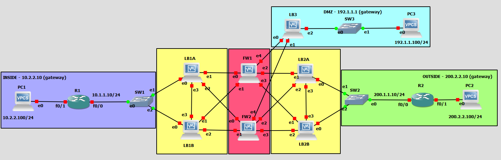
</p>
<p align="center">
  <i> Fig. 1 - Topologia da rede </i>
</p>

### Configuração

Vamos começar por atribuir os endereços IP às interfaces dos routers e aos computadores de acordo com o enunciado.

#### PC1 (computador interno):
```sql
ip 10.2.2.100/24 10.2.2.10
save
```

#### PC2 (computador externo):
```sql
ip 200.2.2.100/24 200.2.2.10
save
```

#### R1 (*router* interno):
```sql
conf t 
ip route 0.0.0.0 0.0.0.0 10.1.1.11 # LB1A
int f0/1
ip add 10.2.2.10 255.255.255.0
no shut
int f0/0
ip add 10.1.1.10 255.255.255.0
no shut
end
write
```

> Na rota estática apenas é necessário definir o *next-hop* para **um dos *load balancers***, uma vez que estes **estão sincronizados**.

#### R2 (*router* externo):
```sql
conf t
ip route 0.0.0.0 0.0.0.0 200.1.1.12 # LB2B
int f0/1
ip add 200.2.2.10 255.255.255.0
no shut
int f0/0
ip add 200.1.1.10 255.255.255.0
no shut

end
write
```

#### LB1A (*load balancer* superior interno):
```sql
configure
set system host-name LB1A

# Interfaces
set interfaces ethernet eth0 address 10.1.1.11/24
set interfaces ethernet eth1 address 10.0.1.11/24
set interfaces ethernet eth2 address 10.0.6.1/24
set interfaces ethernet eth3 address 10.3.1.1/24

# Rotas Estáticas
set protocols static route 10.2.2.0/24 next-hop 10.1.1.10 # R1

# Load-Balancing
set load-balancing wan interface-health eth1 nexthop 10.0.1.12 # FW1
set load-balancing wan interface-health eth2 nexthop 10.0.6.2 # FW2
set load-balancing wan rule 1 inbound-interface eth0
set load-balancing wan rule 1 interface eth1 weight 1
set load-balancing wan rule 1 interface eth2 weight 1
set load-balancing wan sticky-connections inbound
set load-balancing wan disable-source-nat

# VRRP
set high-availability vrrp group LBCluster1 vrid 10
set high-availability vrrp group LBCluster1 interface eth3
set high-availability vrrp group LBCluster1 virtual-address 192.168.100.1/24
set high-availability vrrp sync-group LBCluster1 member LBCluster1
set high-availability vrrp group LBCluster1 rfc3768-compatibility

# Conntrack-sync
set service conntrack-sync accept-protocol 'tcp,udp,icmp'
set service conntrack-sync failover-mechanism vrrp sync-group LBCluster1
set service conntrack-sync interface eth3
set service conntrack-sync mcast-group 225.0.0.50
set service conntrack-sync disable-external-cache

commit
save
```

> Por norma, em ataques DDoS, o objetivo do atacante é sobrecarregar o servidor com um grande volume de tráfego malicioso, tornando-o inacessível para os utilizadores legítimos. Uma das técnicas para mitigar este tipo de ataques é a distribuição de carga de tráfego, de modo a que o servidor não fique sobrecarregado.
>
> No entanto, a sincronização de estados entre os *load balancers* pode ser **prejudicial durante um ataque DDoS**, uma vez que aumenta o overhead de processamento, atrasa a deteção e mitigação do ataque, esgota os recursos e aumenta a complexidade da rede. Por isso, seria preferível o uso de algoritmos de *load balancing* que não requerem esta sincronização.
>
> Alguns exemplos de **algoritmos de *load balancing*** que não requerem a sincronização de estados entre os *load balancers* são:
> - **Round Robin**: Os *requests* são distribuídos sequencialmente pelos servidores, voltando ao primeiro servidor quando o final da lista é atingido.
> - **IP Hash**: Os *requests* são encaminhados para servidores com base num hash do endereço IP do cliente.
> - **Least Connections**: Os *requests* são encaminhados para o servidor com o menor número de conexões ativas.
> - **Random**: Os *requests* são encaminhados para um servidor aleatório, logo nenhum estado é mantido.

#### LB1B (*load balancer* inferior interno):
```sql
configure
set system host-name LB1B

# Interfaces
set interfaces ethernet eth0 address 10.1.1.12/24
set interfaces ethernet eth1 address 10.0.5.1/24
set interfaces ethernet eth2 address 10.0.2.12/24
set interfaces ethernet eth3 address 10.3.1.2/24

# Rotas Estáticas
set protocols static route 10.2.2.0/24 next-hop 10.1.1.10 # R1

# Load-Balancing
set load-balancing wan interface-health eth1 nexthop 10.0.5.2 # FW1
set load-balancing wan interface-health eth2 nexthop 10.0.2.13 # FW2
set load-balancing wan rule 1 inbound-interface eth0
set load-balancing wan rule 1 interface eth1 weight 1
set load-balancing wan rule 1 interface eth2 weight 1
set load-balancing wan sticky-connections inbound
set load-balancing wan disable-source-nat

# VRRP
set high-availability vrrp group LBCluster1 vrid 10
set high-availability vrrp group LBCluster1 interface eth3
set high-availability vrrp group LBCluster1 virtual-address 192.168.100.1/24
set high-availability vrrp sync-group LBCluster1 member LBCluster1
set high-availability vrrp group LBCluster1 rfc3768-compatibility

# Conntrack-sync
set service conntrack-sync accept-protocol 'tcp,udp,icmp'
set service conntrack-sync failover-mechanism vrrp sync-group LBCluster1
set service conntrack-sync interface eth3
set service conntrack-sync mcast-group 225.0.0.50
set service conntrack-sync disable-external-cache

commit
save
```

> A sincronização de estados é feita através do `conntrack-sync`, que permite a sincronização de estados de conexão entre os dispositivos de *firewall*. 

> O mecanismo utilizado é o *fail-over*, onde um dos *load balancers* é definido como o principal e o outro como secundário. O *load balancer* principal é responsável por encaminhar o tráfego para os servidores, enquanto o secundário fica em *standby*, pronto para assumir o controlo em caso de falha do principal, criando redundância.

#### LB2A (*load balancer* superior externo):
```sql
configure
set system host-name LB2A

# Interfaces
set interfaces ethernet eth0 address 200.1.1.11/24
set interfaces ethernet eth1 address 10.0.4.2/24
set interfaces ethernet eth2 address 10.0.8.2/24
set interfaces ethernet eth3 address 10.4.1.1/24

# Rotas Estáticas
set protocols static route 200.2.2.0/24 next-hop 200.1.1.10 # R2

# Load-Balancing
set load-balancing wan interface-health eth1 nexthop 10.0.4.1 # FW1
set load-balancing wan interface-health eth2 nexthop 10.0.8.1 # FW2
set load-balancing wan rule 1 inbound-interface eth0
set load-balancing wan rule 1 interface eth1 weight 1
set load-balancing wan rule 1 interface eth2 weight 1
set load-balancing wan sticky-connections inbound
set load-balancing wan disable-source-nat

# VRRP
set high-availability vrrp group LBCluster2 vrid 10
set high-availability vrrp group LBCluster2 interface eth3
set high-availability vrrp group LBCluster2 virtual-address 192.168.100.2/24
set high-availability vrrp sync-group LBCluster2 member LBCluster2
set high-availability vrrp group LBCluster2 rfc3768-compatibility

# Conntrack-sync
set service conntrack-sync accept-protocol 'tcp,udp,icmp'
set service conntrack-sync failover-mechanism vrrp sync-group LBCluster2
set service conntrack-sync interface eth3
set service conntrack-sync mcast-group 225.0.0.50
set service conntrack-sync disable-external-cache

commit
save
```

> Ativando o *sticky sessions*, permite que os pedidos do cliente sejam sempre encaminhados pelo mesmo *load balancer*.

> Evitando que o *firewall* tenha de sincronizar estados entre os servidores.


#### LB2B (*load balancer* inferior externo):
```sql
configure
set system host-name LB2B

# Interfaces
set interfaces ethernet eth0 address 200.1.1.12/24
set interfaces ethernet eth1 address 10.0.7.2/24
set interfaces ethernet eth2 address 10.0.3.2/24
set interfaces ethernet eth3 address 10.4.1.2/24

# Rotas Estáticas
set protocols static route 200.2.2.0/24 next-hop 200.1.1.10 # R2

# Load-Balancing
set load-balancing wan interface-health eth1 nexthop 10.0.7.1 # FW1
set load-balancing wan interface-health eth2 nexthop 10.0.3.1 # FW2
set load-balancing wan rule 1 inbound-interface eth0
set load-balancing wan rule 1 interface eth1 weight 1
set load-balancing wan rule 1 interface eth2 weight 1
set load-balancing wan sticky-connections inbound
set load-balancing wan disable-source-nat

# VRRP
set high-availability vrrp group LBCluster2 vrid 10
set high-availability vrrp group LBCluster2 interface eth3
set high-availability vrrp group LBCluster2 virtual-address 192.168.100.2/24
set high-availability vrrp sync-group LBCluster2 member LBCluster2
set high-availability vrrp group LBCluster2 rfc3768-compatibility

# Conntrack-sync
set service conntrack-sync accept-protocol 'tcp,udp,icmp'
set service conntrack-sync failover-mechanism vrrp sync-group LBCluster2
set service conntrack-sync interface eth3
set service conntrack-sync mcast-group 225.0.0.50
set service conntrack-sync disable-external-cache

commit
save
```

> Não é necessário a definição de rotas estáticas, pois o *next-hop* já está definido nas configurações de *load balancing*.

#### FW1 (*firewall* superior):
```sql
configure
set system host-name FW1

# Interfaces
set interfaces ethernet eth0 address 10.0.1.12/24
set interfaces ethernet eth1 address 10.0.5.2/24
set interfaces ethernet eth2 address 10.0.4.1/24
set interfaces ethernet eth3 address 10.0.7.1/24
set interfaces ethernet eth4 address 10.0.9.1/24

# Rotas Estáticas
set protocols static route 10.2.2.0/24 next-hop 10.0.1.11 # LB1A
set protocols static route 10.2.2.0/24 next-hop 10.0.5.1 # LB1B
set protocols static route 0.0.0.0/0 next-hop 10.0.4.2 # LB2A
set protocols static route 0.0.0.0/0 next-hop 10.0.7.2 # LB2B
set protocols static route 192.1.1.0/24 next-hop 10.0.9.2 # LB3

# NAT Translation
set nat source rule 10 outbound-interface eth2 # LB2A
set nat source rule 10 source address 10.0.0.0/8
set nat source rule 10 translation address 192.1.0.1-192.1.0.10
set nat source rule 20 outbound-interface eth3 # LB2B
set nat source rule 20 source address 10.0.0.0/8
set nat source rule 20 translation address 192.1.0.11-192.1.0.21

# Zone Definition
(No Ponto 10)

# Zone Policy
(No Ponto 10)

commit
save
```

> Temos uma rota estática para cada *load balancer*, de forma a que caso um deles falhe, o tráfego seja encaminhado para o outro.

> O NAT (*Network Address Translation*) é uma técnica utilizada para traduzir endereços IP e portas de um endereço para outro, permitindo que os dispositivos de uma rede privada comuniquem com dispositivos de uma rede pública. O NAT é utilizado para proteger a rede interna de ataques externos, ocultando os endereços IP privados dos dispositivos internos e permitindo que estes comuniquem com a rede externa através de um único endereço IP público.
> 
> É necessário definir uma regra por interface de saída para o NAT (*outbound-interface*), especificando o intervalo de endereços IP a serem traduzidos (*translation address*).

#### FW2 (*firewall* inferior):
```sql
configure
set system host-name FW2

# Interfaces
set interfaces ethernet eth0 address 10.0.6.2/24
set interfaces ethernet eth1 address 10.0.2.13/24
set interfaces ethernet eth2 address 10.0.8.1/24
set interfaces ethernet eth3 address 10.0.3.1/24
set interfaces ethernet eth4 address 10.0.10.1/24

# Rotas Estáticas
set protocols static route 10.2.2.0/24 next-hop 10.0.2.12 # LB1B
set protocols static route 10.2.2.0/24 next-hop 10.0.6.1 # LB1A
set protocols static route 0.0.0.0/0 next-hop 10.0.3.2 # LB2B
set protocols static route 0.0.0.0/0 next-hop 10.0.8.2 # LB2A
set protocols static route 192.1.1.0/24 next-hop 10.0.10.2 # LB3

# NAT Translation
set nat source rule 10 outbound-interface eth3 # LB2B
set nat source rule 10 source address 10.0.0.0/8
set nat source rule 10 translation address 192.1.0.22-192.1.0.32
set nat source rule 20 outbound-interface eth2 # LB2A
set nat source rule 20 source address 10.0.0.0/8
set nat source rule 20 translation address 192.1.0.33-192.1.0.43


# Zone Definition
(No Ponto 10)

# Zone Policy
(No Ponto 10)

commit
save
```

> É necessário definir uma *pool* de endereços IP para a tradução NAT diferentes para cada interface pois as *firewalls* não estão sincronizadas.

### Testes de Funcionamento (Ana e Simão)

> [!IMPORTANT]
> Descrever os testes de funcionamento realizados e os resultados obtidos.

A realizar:
- [x] Testar a conectividade entre os computadores internos e externos.
- [ ] Verificar a distribuição de carga de tráfego entre os *load balancers* (comandos que enviei para o discord).
- [ ] Verificar a sincronização de estados entre os *load balancers* (comandos que enviei para o discord).
- [x] Verificar a tabela de rotas dos *routers* e dos *load balancers*.
- [x] Verificar a tradução NAT dos endereços IP.

Para testar a conectividade entre os computadores internos e externos, foi utilizado o comando `ping 200.2.2.100 -P 17 -p 5001` que envia pacotes UDP para o computador externo.

<p align="center">
  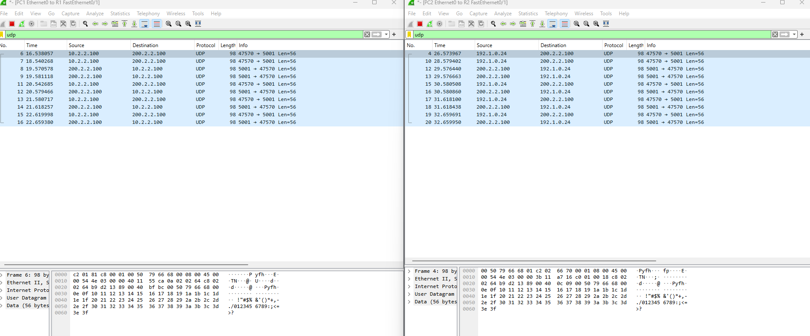
</p>
<p align="center">
  <i> Fig. 2 - Captura Wireshark entre a rede interna e a rede externa com filtragem para o protocolo UDP. </i>
</p>

Também foi feito o mesmo teste, mas com o protocolo ICMP, para verificar se a conexão é estabelecida corretamente (`ping 200.2.2.100`).

<p align="center">
  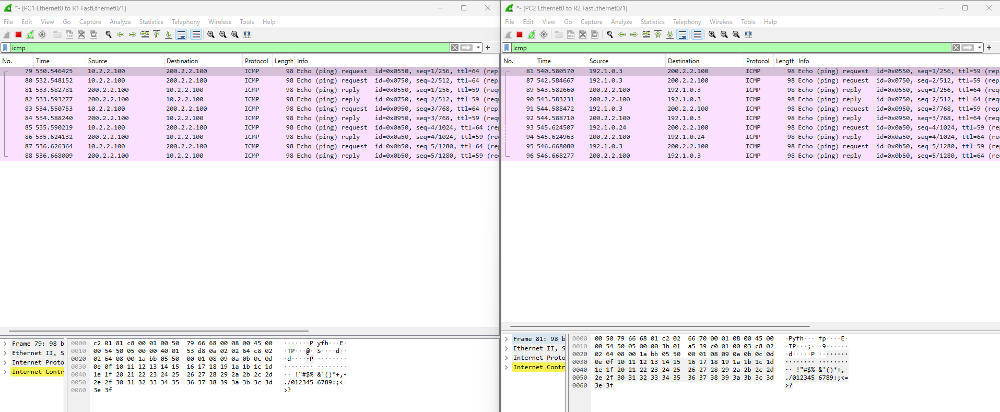
</p>
<p align="center">
  <i> Fig. 3 - Captura Wireshark entre a rede interna e a rede externa com filtragem para o protocolo ICMP. </i>
</p>

As rotas de rede foram verificadas nos *routers* e nos *load balancers* para garantir que o tráfego é encaminhado corretamente para os destinos pretendidos.

<div style="display: flex; justify-content: center;">
  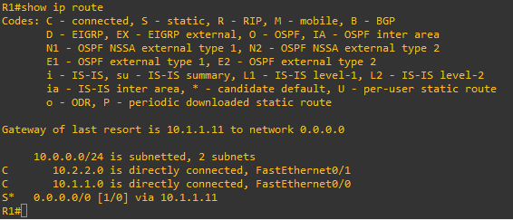
  
</div>

<p align="center">
  <i> Fig. 4 - Tabela de rotas do R1 e R2 </i>
</p>

<div style="display: flex; justify-content: center;">
  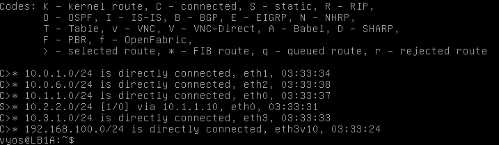
  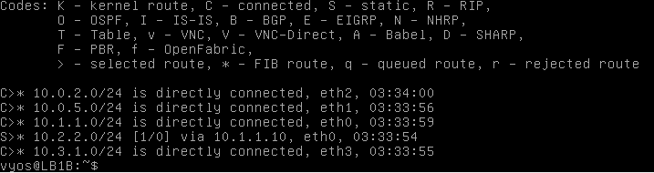
</div>

<p align="center">
  <i> Fig. 5 - Tabela de rotas do LB1A e LB1B </i>
</p>

<div style="display: flex; justify-content: center;">
  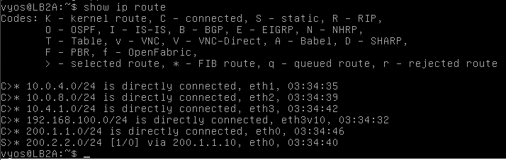
  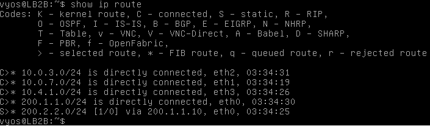
</div>

<p align="center">
  <i> Fig. 6 - Tabela de rotas do LB2A e LB2B </i>
</p>

Como podemos verificar pelas tabelas de tradução NAT, os endereços IP dos computadores internos foram traduzidos para endereços IP públicos.

<p align="center">
  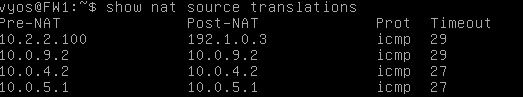
</p>
<p align="center">
  <i> Fig. 7 - VyOS NAT Translation </i>
</p>

### Questões finais

**1. Explain why the synchronization of the load-balancers allows the nonexistence of firewall synchronization.**

   R: A sincronização feita nos load balancers permite que os pedidos do cliente atinjam sempre o mesmo servidor, evitando que o firewall tenha de sincronizar estados entre os servidores. Isto é feito através do conceito de *sticky sessions*, que permite que os pedidos do cliente sejam sempre encaminhados para o mesmo servidor, evitando que o firewall tenha de sincronizar estados entre os servidores.

**2. Which load balancing algorithm may also allow the nonexistence of load-balancers synchronization?**

   R: Um algoritmo load balancing que não requer a sincronização de estados entre os load balancers é o algoritmo *IP Hash*. Neste algoritmo, os pedidos são encaminhados para servidores com base num hash do endereço IP do cliente. Deste modo, o pedido do cliente é sempre encaminhado para o mesmo servidor, evitando que o firewall tenha de sincronizar estados entre os servidores.

**3. Explain why device/connection states synchronization may be detrimental during a DDoS attack.**
   
   R: Durante um ataque DDoS, a sincronização de estados nos load balancers pode ser prejudicial devido ao aumento do overhead de processamento, atrasos na deteção e mitigação do ataque, esgotamento de recursos e aumento da complexidade da rede. Isso pode comprometer a capacidade dos load balancers de lidar eficazmente com o grande volume de tráfego malicioso, colocando em risco a disponibilidade dos serviços.

## Ponto 10

<p align="center">
  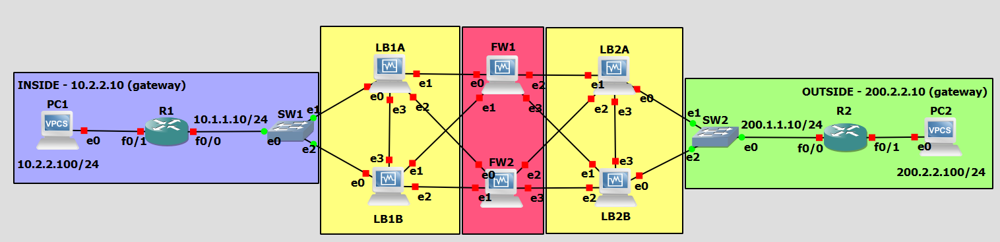
</p>
<p align="center">
  <i> Fig. 8 - Topologia da rede com a DMZ </i>
</p>

Servidor DMZ (Por escrever):
```sql
ip 192.1.1.100/24 192.1.1.1
save
```

> A DMZ (*Demilitarized Zone*) é uma sub-rede isolada que separa a rede interna da rede externa, permitindo que os servidores públicos sejam acessíveis a partir da Internet, mas não diretamente da rede interna.

LB3 (*load balancer* DMZ - Por corrigir):
```sql
configure
set system host-name LB3

# Interfaces
set interfaces ethernet eth0 address 10.0.9.2/24
set interfaces ethernet eth1 address 10.0.10.2/24
set interfaces ethernet eth2 address 192.1.1.1/24

# Load-Balancing
set load-balancing wan interface-health eth0 nexthop 10.0.9.1
set load-balancing wan interface-health eth1 nexthop 10.0.10.1
set load-balancing wan rule 1 inbound-interface eth2
set load-balancing wan rule 1 interface eth0 weight 1
set load-balancing wan rule 1 interface eth1 weight 1
set load-balancing wan sticky-connections inbound
set load-balancing wan disable-source-nat

commit
save
```

> Neste caso foi utilizado apenas um *load balancer* para a DMZ, uma vez que a redundância já é garantida pelos *load balancers* superiores e inferiores.

### Definição de Zonas

Para definir as zonas de segurança, foram criadas as seguintes zonas nas *firewalls* `FW1` e `FW2`:

```sql
set zone-policy zone INSIDE description "Inside (Internal Network)"
set zone-policy zone INSIDE interface eth0
set zone-policy zone INSIDE interface eth1
set zone-policy zone OUTSIDE description "Outside (External Network)"
set zone-policy zone OUTSIDE interface eth2
set zone-policy zone OUTSIDE interface eth3
set zone-policy zone DMZ description "DMZ (Server Farm)"
set zone-policy zone DMZ interface eth4
```

> Após inserir estas configurações, a conectividade é afetada, uma vez que o tráfego entre as zonas é bloqueado por padrão. Para permitir o tráfego entre as zonas, é necessário definir regras de controlo de tráfego.

### Descrição da Configuração

Para limitar o acesso à rede, as seguintes ACLs foram implementadas nas *firewalls*:

```sql
set firewall name CONTROLLED default-action drop
set firewall name ESTABLISHED default-action drop
```

> A lista de acessos `CONTROLLED` é utilizada para definir as regras de controlo de tráfego (o que pode ou não passar), enquanto a lista `ESTABLISHED` é utilizada para definir as regras de tráfego já estabelecido.
>
> Por padrão, todo o tráfego é bloqueado, sendo necessário definir regras para permitir o tráfego entre as zonas.

### Regras entre Zonas

Foram escolhidas um conjunto de regras para implementar nas firewalls, de forma a garantir a segurança e a integridade da rede mitigando ataques comuns à rede (e.g SYN Flood na regra `6`, DDoS na regra `4`).

Lista de regras entre zonas:
1. Permitir tráfego de saída do INSIDE dos seguintes protocolos: TCP, UDP, ICMP, SSH, HTTP, DNS e HTTPS;
2. Permitir tráfego já estabelecido pelo INSIDE;
3. Bloquear qualquer tráfego de saida do OUTSIDE para os endereços IP privados (ip privado: 10.2.2.0/24);
4. Limitar o tráfego de rede para o servidor DMZ (porta 4 das FWs) para 25 Mbps;
5. Permitir acesso ao servidor DMZ apenas em horário laboral (9h-18h);
6. Limitar o envio de pacotes SYN para 100 por segundo;


Nas *firewalls* `FW1` e `FW2`, as regras assim definidas:

```sql
configure

# Regra 1 - Definição de conexões permitidas
set firewall name CONTROLLED rule 11 description "Accept HTTP" # HTTP traffic
set firewall name CONTROLLED rule 11 action accept
set firewall name CONTROLLED rule 11 protocol tcp
set firewall name CONTROLLED rule 11 destination address 0.0.0.0/0
set firewall name CONTROLLED rule 11 destination port 80

set firewall name CONTROLLED rule 12 description "Accept HTTPS" # HTTPS traffic
set firewall name CONTROLLED rule 12 action accept
set firewall name CONTROLLED rule 12 protocol tcp
set firewall name CONTROLLED rule 12 destination address 0.0.0.0/0
set firewall name CONTROLLED rule 12 destination port 443

set firewall name CONTROLLED rule 13 description "Accept SSH" # SSH traffic
set firewall name CONTROLLED rule 13 action accept
set firewall name CONTROLLED rule 13 protocol tcp
set firewall name CONTROLLED rule 13 destination address 0.0.0.0/0
set firewall name CONTROLLED rule 13 destination port 22

set firewall name CONTROLLED rule 14 description "Accept ICMP" # ICMP traffic
set firewall name CONTROLLED rule 14 action accept
set firewall name CONTROLLED rule 14 protocol icmp
set firewall name CONTROLLED rule 14 destination address 0.0.0.0/0

set firewall name CONTROLLED rule 15 description "Accept DNS TCP/UDP" # DNS traffic
set firewall name CONTROLLED rule 15 action accept
set firewall name CONTROLLED rule 15 protocol tcp_udp
set firewall name CONTROLLED rule 15 destination address 0.0.0.0/0
set firewall name CONTROLLED rule 15 destination port 53

# Regra 2 - Conexões já estabelecidas
set firewall name ESTABLISHED rule 20 description "Accept Established-Related Connections"
set firewall name ESTABLISHED rule 20 action accept
set firewall name ESTABLISHED rule 20 state established enable
set firewall name ESTABLISHED rule 20 state related enable

# Regra 3 - Bloqueio p/ endereços privados
set firewall name CONTROLLED rule 30 description "Block Private IP Addresses"
set firewall name CONTROLLED rule 30 action drop
set firewall name CONTROLLED rule 30 source address 0.0.0.0/0
set firewall name CONTROLLED rule 30 destination address 10.2.2.0/24 # Private IP Address

# Regra 4 - Rate limiting 
set traffic-policy shaper RATE-LIMIT bandwidth 25mbit 
set traffic-policy shaper RATE-LIMIT default bandwidth 100% 
set interfaces ethernet eth4 traffic-policy out RATE-LIMIT

# Regra 5 - Horário laboral p/ servidor DMZ
set firewall name CONTROLLED rule 50 description "Allow DMZ Access During Business Hours"
set firewall name CONTROLLED rule 50 action accept
set firewall name CONTROLLED rule 50 state new enable
set firewall name CONTROLLED rule 50 time starttime 09:00:00
set firewall name CONTROLLED rule 50 time stoptime 18:00:00
set firewall name CONTROLLED rule 50 destination address 192.1.1.0/24


# Regra 6 - Mitigação de SYN Flood
set firewall name CONTROLLED rule 60 description "SYN Flood Protection"
set firewall name CONTROLLED rule 60 action drop
set firewall name CONTROLLED rule 60 protocol tcp
set firewall name CONTROLLED rule 60 state new enable
set firewall name CONTROLLED rule 60 tcp flags 'SYN'
set firewall name CONTROLLED rule 60 limit rate 100/second

commit
save
```

> Ataques SYN Flood (inundação de *SYN requests* sem receção do *ACK request*) ainda são comuns e uma abordagem eficaz para mitigar este tipo de ataque é limitar o número de pacotes SYN que um host pode enviar por segundo, referido na regra `6`.

### Aplicação das Regras

Nas *firewalls* `FW1` e `FW2`, as regras foram aplicadas da seguinte forma:

<p align="center">
  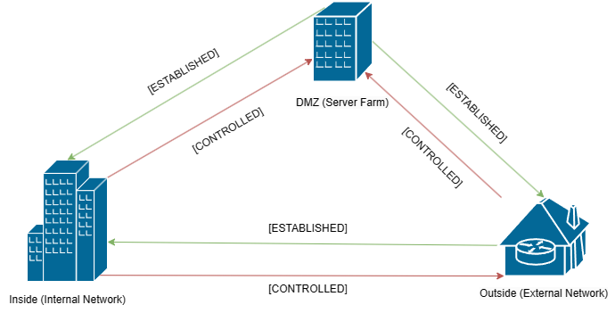
</p>
<p align="center">
  <i> Fig. 9 - Diagrama de aplicação das ACLs </i>
</p>

```sql
# p/ DMZ
set zone-policy zone DMZ from INSIDE firewall name CONTROLLED
set zone-policy zone DMZ from OUTSIDE firewall name CONTROLLED

# p/ OUTSIDE
set zone-policy zone OUTSIDE from INSIDE firewall name CONTROLLED
set zone-policy zone OUTSIDE from DMZ firewall name ESTABLISHED

# p/ INSIDE
set zone-policy zone INSIDE from OUTSIDE firewall name ESTABLISHED
set zone-policy zone INSIDE from DMZ firewall name ESTABLISHED
```

> Ou seja, todo o tráfego para o exterior e para o DMZ (por conta de ser uma zona isolada) é filtrado, enquanto o tráfego restante é estabelecido por regras já existentes.

### Testes de Funcionamento (Ana e Simão)

> [!IMPORTANT]
> Descrever os testes de funcionamento realizados e os resultados obtidos.

A realizar:
- [ ] Testar a conectividade entre as zonas;
- [ ] Verificar se as regras de controlo de tráfego estão a ser aplicadas corretamente (e.g. Conectar-se ao servidor DMZ dentro e fora do horário laboral);
- [ ] Testar a limitação de tráfego para o servidor DMZ;
- [ ] Exibir os logs de tráfego das firewalls (`show log firewall name <ACL>`).;

## Conclusão 

> [!TIP]
> **Comentário**: Muito genérico, falar o que foi aprendido e o que esse novo conhecimento pode trazer, exemplo: "A implementação de dois load-balancers permitiu perceber os riscos que a escolha de um algoritmo não adequado pode trazer para a integridade da rede". Falar sobre o conhecimento obtido na fase de testes e como procedemos á resolução dos problemas que encontramos. Falar o que irá ser melhorado em trabalhos futuros, seja organizacional ou técnico.

Em síntese, a implementação de firewalls de alta disponibilidade é de suma importância para garantir a continuidade operacional e a segurança das redes empresariais. Através da plataforma VyOS, foram explorados diversos cenários de configuração com o intuito de maximizar a disponibilidade e a resiliência dos sistemas de segurança de rede. Ao configurar quatro load balancers, onde dois deles estão sincronizados entre si, e distribuir de forma equilibrada o tráfego entre eles, foi possível mitigar falhas de hardware e assegurar uma proteção contínua contra ameaças cibernéticas. Adicionalmente, a integração do conntrack-sync nos load balancers permitiu uma sincronização eficiente dos estados de conexão, contribuindo para uma resposta mais eficaz e robusta da infraestrutura de segurança.

Por outro lado, ao conectar as duas firewalls aos load balancers, estabeleceu-se um ambiente de alta disponibilidade com redundância, onde cada firewall atua como um gateway seguro entre as duas zonas da rede: a outside e a inside. A utilização de rotas estáticas sincronizadas entre os load balancers garantiu uma distribuição eficiente da carga de trabalho e uma alta disponibilidade dos serviços em ambas as zonas.

Este trabalho visa contribuir significativamente para a compreensão e implementação de firewalls de alta disponibilidade com a plataforma VyOS. 
