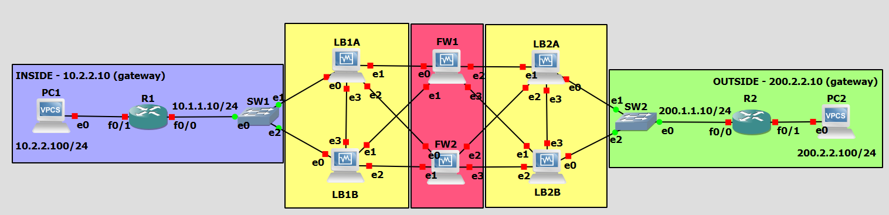

# Trabalho prático 1 de Segurança em Redes de Computadores

## Autores
- Ana Vidal (118408)
- Simão Andrade (118345)

## Estrutura do Relatório
- Introdução;
- Estado-de-Arte (Simão)
- Rotas de Rede e conectividade;
- Load-Balancers;
- Configuração da Firewall:
  - Zonas e Regras;
- Questões Finais;
- Testes de Funcionamento (Ana e Simão)
- Conclusão (ChatGPT)

## Objetivo
Apresentar um relatório dos **testes de configuração** e de **funcionamento** dos cenários descritos nos pontos `9` e `10` do guia laboratorial “High-Availability Firewall Scenarios”.

Temos as seguintes tarefas a serem realizadas:

- [ ] Firewall and load-balancers deployment (2 valores).
- [x] Network routing and connectivity (2 valores).
- [ ] Devices state synchronization (3 valores).
- [ ] Zones definition (3 valores).
- [ ] Inter-zone rules (6 valores).
- [ ] Report (4 valores).

## Introdução
Nos dias de hoje, a continuidade operacional e a segurança das redes desempenham um papel crítico no ambiente empresarial. No âmbito da segurança cibernética, os firewalls assumem uma importância inegável na proteção dos ativos e na defesa contra ameaças digitais. Este trabalho tem como objetivo explorar os cenários de firewalls de alta disponibilidade utilizando a plataforma VyOS. O VyOS é uma solução de código aberto reconhecida pela sua flexibilidade e recursos avançados de segurança. Focar-nos-emos na configuração de firewalls redundantes e na distribuição de carga de tráfego, com o propósito de garantir a disponibilidade contínua dos serviços de rede. Adicionalmente, iremos analisar a implementação de funcionalidades como o conntrack-sync, que permite a sincronização de estados de conexão entre os dispositivos de firewall, potenciando ainda mais a resiliência da infraestrutura de segurança. 

## Estado-de-Arte

Explicar os seguintes conceitos:
- **Firewall**;
- **Zonas e Regras**;
- **Load Balancer**;
- **State Synchronization**;
- **Redundancy Synchronization**;

## Ponto 9

### Topologia

<p align="center">
  
</p>

### Rotas e Conectividade da Rede

Vamos começar por atribuir os endereços IP às interfaces dos routers e aos computadores de acordo com o enunciado.

PC1 (computador interno):
```
ip 10.2.2.100/24 10.2.2.10
save
```

PC2 (computador externo):
```
ip 200.2.2.100/24 200.2.2.10
save
```

R1 (*router* interno):
```cli
conf t 
ip route 0.0.0.0 0.0.0.0 10.1.1.11
ip route 0.0.0.0 0.0.0.0 10.1.1.12
int f0/1
ip add 10.2.2.10 255.255.255.0
no shut
int f0/0
ip add 10.1.1.10/24
no shut
end
write
```

IP NAT: 192.1.0.0/23
Mascara do IP NAT: 255.255.254.0 

R2 (*router* externo):
```cli
conf t
ip route 192.1.0.0 255.255.254.0 200.1.1.11
ip route 192.1.0.0 255.255.254.0 200.1.1.11
int f0/1
ip add 200.2.2.10 255.255.255.0
no shut
int f0/0
ip add 200.1.1.10 255.255.255.0
no shut
end
write
```

LB1A (*load balancer* superior interno):
```cli
set system host-name LB1A
set interfaces ethernet eth0 address 10.1.1.11/24
set interfaces ethernet eth1 address 10.0.1.11/24
set interfaces ethernet eth2 address 10.0.6.1/24
set interfaces ethernet eth3 address 10.3.1.1/24
commit
save
```

LB1B (*load balancer* inferior interno):
```cli
set system host-name LB1B
set interfaces ethernet eth0 address 10.1.1.12/24
set interfaces ethernet eth1 address 10.0.5.1/24
set interfaces ethernet eth2 address 10.0.2.12/24
set interfaces ethernet eth3 address 10.3.1.2/24
commit
save
```

FW1 (*firewall* superior):
```cli
set system host-name FW1
set interfaces ethernet eth0 address 10.0.1.12/24
set interfaces ethernet eth1 address 10.0.5.2/24
set interfaces ethernet eth2 address 10.0.4.1/24
set interfaces ethernet eth3 address 10.0.7.1/24

set nat source outbound-interface eth0
set nat source rule 10 source address 10.0.0.0/8
set nat nat source rule 100 translation address 192.1.0.1-192.1.0.10

commit
save
```

FW2 (*firewall* inferior):
```cli
set system host-name FW2
set interfaces ethernet eth0 address 10.0.6.2/24
set interfaces ethernet eth1 address 10.0.2.13/24
set interfaces ethernet eth2 address 10.0.8.1/24
set interfaces ethernet eth3 address 10.0.3.1/24

set nat source outbound-interface eth0
set nat source rule 10 source address 10.0.0.0/8
set nat nat source rule 100 translation address 192.1.0.1-192.1.0.10

commit
save
```

LB2A (*load balancer* superior externo):
```cli
set system host-name LB2A
set interfaces ethernet eth0 address 200.1.1.11/24
set interfaces ethernet eth1 address 10.0.4.2/24
set interfaces ethernet eth2 address 10.0.8.2/24
set interfaces ethernet eth3 address 10.4.1.1/24

commit
save
```

LB2B (*load balancer* inferior externo):
```cli
set system host-name LB2B
set interfaces ethernet eth0 address 200.1.1.12/24
set interfaces ethernet eth1 address 10.0.7.2/24
set interfaces ethernet eth2 address 10.0.3.2/24
set interfaces ethernet eth3 address 10.4.1.2/24

commit
save
```

### Load-Balancers

LB1A (*load balancer* superior interno):
```cli
set load-balancing wan interface-health eth1 next-hop 10.0.1.12
set load-balancing wan interface-health eth2 next-hop 10.0.6.2
set load-balancing wan interface-health eth3 next-hop 10.3.1.2
set load-balancing wan rule 1 inbound-interface eth0
set load-balancing wan rule 1 eth1 weight 1
set load-balancing wan rule 1 eth2 weight 1
set load-balancing wan rule 1 eth3 weight 1
set load-balancing wan sticky-connections inbound
set load-balancing wan disable-source-nat

commit
save
```

LB1B (*load balancer* Superior externo):
```cli
set load-balancing wan interface-health eth1 next-hop 10.0.5.1
set load-balancing wan interface-health eth2 next-hop 10.0.2.13
set load-balancing wan interface-health eth3 next-hop 10.0.3.1
set load-balancing wan rule 1 inbound-interface eth0
set load-balancing wan rule 1 eth1 weight 1
set load-balancing wan rule 1 eth2 weight 1
set load-balancing wan rule 1 eth3 weight 1
set load-balancing wan sticky-connections inbound
set load-balancing wan disable-source-nat

commit
save
```

LB2A (*load balancer* inferior externo):
```cli
set load-balancing wan interface-health eth1 next-hop 10.0.4.1
set load-balancing wan interface-health eth2 next-hop 10.0.8.1
set load-balancing wan interface-health eth3 next-hop 10.4.1.2
set load-balancing wan rule 1 inbound-interface eth0
set load-balancing wan rule 1 eth1 weight 1
set load-balancing wan rule 1 eth2 weight 1
set load-balancing wan rule 1 eth3 weight 1
set load-balancing wan sticky-connections inbound
set load-balancing wan disable-source-nat

commit
save
```

LB2B (*load balancer* inferior interno):
```cli
set load-balancing wan interface-health eth1 next-hop 10.0.7.1
set load-balancing wan interface-health eth2 next-hop 10.0.3.1
set load-balancing wan interface-health eth3 next-hop 10.4.1.1
set load-balancing wan rule 1 inbound-interface eth0
set load-balancing wan rule 1 eth1 weight 1
set load-balancing wan rule 1 eth2 weight 1
set load-balancing wan rule 1 eth3 weight 1
set load-balancing wan sticky-connections inbound
set load-balancing wan disable-source-nat

commit
save
```

### Sincronização de Estados (*State Synchronization*)

VRRP no LB1A e LB1B:
```cli
set high-availability vrrp group LBCluster1 vrid 10
set high-availability vrrp group LBCluster1 interface eth5
set high-availability vrrp group LBCluster1 virtual-address 192.168.101.1/24
set high-availability vrrp sync-group LBCluster1 member LBCluster1
set high-availability vrrp group LBCluster1 rfc3768-compatibility
```

conntrack-sync no LB1A e LB1B:
```cli
set service conntrack-sync accept-protocol 'tcp,udp,icmp'
set service conntrack-sync failover-mechanism vrrp sync-group LBCluster1
set service conntrack-sync interface eth5
set service conntrack-sync mcast-group 225.0.0.51
set service conntrack-sync disable-external-cache
```

### Definição de Zonas

Definição de Zona Inside:
```cli
set zone-policy zone INSIDE description "Inside (Internal Network)"
set zone-policy zone INSIDE interface eth0
set zone-policy zone INSIDE interface eth1
```
Definição de Zona Outside:
```cli
set zone-policy zone OUTSIDE description "Outside (External Network)"
set zone-policy zone OUTSIDE interface eth2
set zone-policy zone OUTSIDE interface eth3
```

### Regras entre Zonas

Listagem de regras entre zonas:
1. Permitir qualquer tráfego de saída do INSIDE para o OUTSIDE;
2. Permite o tráfego já estabelecido pelo INSIDE para o OUTSIDE;
3. Bloquear qualquer tráfego de saida do OUTSIDE para os endereços IP privados (ip privado: 10.1.1.0/24);
4. Bloquear pacotes ICMP do OUTSIDE para o INSIDE;
5. Permitir tráfego de entrada do OUTSIDE para o INSIDE apenas nas portas específicas 80 (HTTP) e 443 (HTTPS); (Ana Vidal)
6. Bloquear qualquer tráfego de entrada do OUTSIDE para o INSIDE nas portas não autorizadas; (Ana Vidal)
**Só depois de implementar o DMZ**
1. Permitir tráfego de saída do INSIDE para um servidor específico no DMZ na porta 443 (HTTPS);(Ana Vidal)
2. Permitir tráfego de entrada do DMZ para o INSIDE apenas nas portas específicas 80 (HTTP) e 443 (HTTPS); (Ana Vidal)


#### Regra 1
```cli
set firewall name INSIDE-OUTSIDE rule 1 action accept
set firewall name INSIDE-OUTSIDE rule 1 source zone INSIDE
set firewall name INSIDE-OUTSIDE rule 1 destination zone OUTSIDE
set firewall name INSIDE-OUTSIDE rule 1 state established enable
set zone-policy zone INSIDE from OUTSIDE firewall name INSIDE-OUTSIDE

commit
save
```

#### Regra 2

```cli
set firewall name INSIDE-OUTSIDE rule 2 action accept
set firewall name INSIDE-OUTSIDE rule 2 source zone INSIDE
set firewall name INSIDE-OUTSIDE rule 2 destination zone OUTSIDE
set firewall name INSIDE-OUTSIDE rule 2 state related enable
```

#### Regra 3 (ip privado: 10.1.1.0/24)

```cli
set firewall name OUTSIDE-INSIDE rule 2 action drop
set firewall name OUTSIDE-INSIDE rule 2 source zone OUTSIDE
set firewall name OUTSIDE-INSIDE rule 2 destination address 10.1.1.0/24
```

#### Regra 4

```cli
set firewall name OUTSIDE-INSIDE rule 3 action drop
set firewall name OUTSIDE-INSIDE rule 3 source zone OUTSIDE
set firewall name OUTSIDE-INSIDE rule 3 destination zone INSIDE
set firewall name OUTSIDE-INSIDE rule 3 protocol icmp
```

### Questões finais

1. Explain why the synchronization of the load-balancers allows the nonexistence of firewall synchronization.

R: A sincronização feita nos load balancers permite que os pedidos do cliente atinjam sempre o mesmo servidor, evitando que o firewall tenha de sincronizar estados entre os servidores.

Isto é feito através do conceito de *sticky sessions*, que permite que os pedidos do cliente sejam sempre encaminhados para o mesmo servidor, evitando que o firewall tenha de sincronizar estados entre os servidores.

2. Which load balancing algorithm may also allow the nonexistence of load-balancers synchronization?
   R: Using IP Hash LB algorithms doesn't require routing history synchronization (between LB). Using other LB algorithms, they must share routing history.
4. Explain why device/connection states synchronization may be detrimental during a DDoS attack
   R: Durante um ataque DDoS, a sincronização de estados nos load balancers pode ser prejudicial devido ao aumento do overhead de processamento, atrasos na detecção e mitigação do ataque, esgotamento de recursos e aumento da complexidade da rede. Isso pode comprometer a capacidade dos load balancers de lidar eficazmente com o grande volume de tráfego malicioso, colocando em risco a disponibilidade dos serviços.

## Ponto 10 (Ainda não chegámos aqui)

## Conclusão
Em síntese, a implementação de firewalls de alta disponibilidade é de suma importância para garantir a continuidade operacional e a segurança das redes empresariais. Através da plataforma VyOS, foram explorados diversos cenários de configuração com o intuito de maximizar a disponibilidade e a resiliência dos sistemas de segurança de rede. Ao configurar quatro load balancers, onde dois deles estão sincronizados entre si, e distribuir de forma equilibrada o tráfego entre eles, foi possível mitigar falhas de hardware e assegurar uma proteção contínua contra ameaças cibernéticas. Adicionalmente, a integração do conntrack-sync nos load balancers permitiu uma sincronização eficiente dos estados de conexão, contribuindo para uma resposta mais eficaz e robusta da infraestrutura de segurança.

Por outro lado, ao conectar as duas firewalls aos load balancers, estabeleceu-se um ambiente de alta disponibilidade com redundância, onde cada firewall atua como um gateway seguro entre as duas zonas da rede: a outside e a inside. A utilização de rotas estáticas sincronizadas entre os load balancers garantiu uma distribuição eficiente da carga de trabalho e uma alta disponibilidade dos serviços em ambas as zonas.

Este trabalho visa contribuir significativamente para a compreensão e implementação de firewalls de alta disponibilidade com a plataforma VyOS. 
